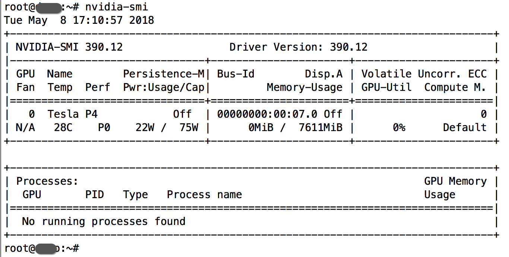

# AltLSS（Ubuntu）
[](https://vrviu.com)
## 版本
2.0
## 功能说明
提供高清晰度、高码率视频流的接流、转码和分发功能。

## 产品特点

* **支持传输协议**：RTMP, HTTP FLV, HLS

* **音视频编码**：H.264, H.265, AAC

* **最大分辨率**：4K

* **播放模式**：直播

*  **编码方式**：硬编

* **解码方式**：硬解

* **高性能**：提供高清晰度、高码率视频流的转码

* **低延迟**：领先于业界的转码延迟

## 环境需求
**操作系统**：[Ubuntu 16.04 Server](https://www.ubuntu.com.cn/download/server)或更高版本

**软件环境**：[Docker 17.03.0-ce](https://docs.docker.com/release-notes/docker-ce/)或更高版本

**硬件需求**：NVIDIA TESLA P4显卡或更高版本

**Docker镜像**：hub-docker.vrviu.com/vrviu-altlss:2.0


## 快速体验
* 参照[部署过程](https://github.com/vrviu-sdk/AltLSS#%E9%83%A8%E7%BD%B2%E8%BF%87%E7%A8%8B)中相关步骤，在部署Ubuntu 16.04 Server的服务器上安装Docker环境和显卡驱动，运行Docker镜像便可启动VRVIU-AltLSS服务。
* 使用OBS软件或FFmpeg推流至VRVIU-AltLSS服务，VRVIU-AltLSS服务实时处理视频流的接流、转码和分发，客户端使用[AltPlayer](https://github.com/vrviu-sdk/VRVIU-AltPlayer-Demo-Android)播放体验。

## 部署过程
### 1. 安装显卡驱动
##### 下载显卡驱动安装包至服务器
```
sudo wget https://cn.download.nvidia.com/tesla/390.12/nvidia-diag-driver-local-repo-ubuntu1604-390.12_1.0-1_amd64.deb
```
##### 使用如下命令安装
```
sudo dpkg -i nvidia-diag-driver-local-repo-ubuntu1604-390.12_1.0-1_amd64.deb
```
##### 添加apt公钥文件
```
sudo apt-key add /var/nvidia-diag-driver-local-repo-390.12/7fa2af80.pub
```
##### 更新apt源并安装CUDA驱动
```
sudo apt-get update && apt-get -y install cuda-drivers
```
##### 安装完成后重启服务器
```
sudo reboot
```
##### 重启后重新登录服务器执行<code>nvidia-smi</code>验证，预期输出如下


### 2. 安装CUDA Toolkit
##### 下载CUDA Toolkit repo安装包至服务器
```
sudo wget https://developer.download.nvidia.com/compute/cuda/repos/ubuntu1604/x86_64/cuda-repo-ubuntu1604_9.1.85-1_amd64.deb
```
##### 使用如下命令安装
```
sudo dpkg -i cuda-repo-ubuntu1604_9.1.85-1_amd64.deb
```
##### 更新apt源并安装CUDA Toolkit
```
sudo apt-get update && apt-get -y install cuda
```
##### 安装完成后重启服务器
```
sudo reboot
```

### 3. 安装[docker-ce](https://docs.docker.com/release-notes/docker-ce/)
##### 如果服务器上已安装docker.io,请先卸载原有docker.io包
```
sudo apt-get -y remove \
  docker-engine \
  docker.io
```
##### 安装[docker-ce](https://docs.docker.com/release-notes/docker-ce/)依赖
```
sudo apt-get -y install \
  aufs-tools \
  subversion \
  libcurl4-nss-dev \
  cgroup-lite
```
##### 更新apt源
```
sudo apt-get update
```
##### 允许apt使用https
```
sudo apt-get -y install \
  apt-transport-https \
  ca-certificates \
  curl \
  software-properties-common
```
##### 添加Docker官方GPG key
```
curl -fsSL https://download.docker.com/linux/ubuntu/gpg | sudo apt-key add -
```
##### 添加Docker官方stable源
```
add-apt-repository \
  "deb [arch=amd64] https://download.docker.com/linux/ubuntu \
  $(lsb_release -cs) \
  stable"
```
##### 再次更新apt源并安装[docker-ce](https://docs.docker.com/release-notes/docker-ce/)
```
sudo apt-get update && apt-get -y install docker-ce
```

### 4. 配置GPU容器运行环境
 **请注意**：如果你手动修改过<code>/etc/docker/daemon.json</code>, 该过程会覆盖你的修改。
 
##### 添加nvidia-docker安装源
```
sudo curl -s -L https://nvidia.github.io/nvidia-docker/gpgkey | \
  sudo apt-key add -
distribution=$(. /etc/os-release;echo $ID$VERSION_ID)
sudo curl -s -L https://nvidia.github.io/nvidia-docker/$distribution/nvidia-docker.list | \
  sudo tee /etc/apt/sources.list.d/nvidia-docker.list
```
##### 更新apt源并安装nvidia-docker2
```
sudo apt-get update && apt-get install -y nvidia-docker2
```
##### 重新加载Docker daemon配置
```
sudo pkill -SIGHUP dockerd
```

### 5. 拉取VRVIU-LSS Docker镜像并运行

##### 拉取VRVIU-LSS Docker镜像至服务器
```
docker pull hub-docker.vrviu.com/vrviu-altlss:2.0
```
##### 在服务器上创建鉴权文件<code>/etc/vrviu-altlss/auth.conf</code>，获取[配置信息](https://github.com/vrviu-sdk/VRVIU-LSS#%E8%B4%A6%E5%8F%B7%E9%89%B4%E6%9D%83%E5%8F%82%E6%95%B0%E8%A1%A8)并填入，鉴权文件格式如下：
```
cat /etc/vrviu-lss/auth.conf
[lss]
AppId=$AppId
BizId=$BizId
AccessKeyId=$AccessKeyId
AccessKey=$AccessKey
```
##### 运行VRVIU-LSS Docker镜像启动服务
```
docker run -d \
  --net=host \
  --privileged=true \
  --runtime=nvidia \
  --restart=always \
  -v /usr/lib/nvidia-390:/usr/lib/nvidia-390:ro \
  -v /etc/vrviu-altlss/auth.conf:/app/lss/conf/auth.conf \
  -v /etc/localtime:/etc/localtime \
  hub-docker.vrviu.com/vrviu-altlss:2.0
```

### 6. 推流并验证播放

##### 使用OBS软件或FFmpeg推流至下面地址，替换hostname为部署服务的主机名或IP
```
rtmp://hostname:19350/live/altlss
```
##### 转码后的视频使用[AltPlayer](https://github.com/vrviu-sdk/VRVIU-AltPlayer-Demo-Android)播放地址如下：
```
http://hostname:8081/live/altlss.flv
```


## 账号鉴权参数表

|参数|说明|是否必填|类型|
|:---|:---|:---|:---|
|AppId|分配给用户的ID，可通过 [www.vrviu.com](https://www.vrviu.com/) 填写表单或者联系客服申请|必填|String|
|AccessKeyId|分配给用户的ID，可通过 [www.vrviu.com](https://www.vrviu.com/) 填写表单或者联系客服申请|必填|String|
|BizId|分配给用户的ID，可通过 [www.vrviu.com](https://www.vrviu.com/) 填写表单或者联系客服申请|必填|String|
|AccessKey|分配给用户的ID，可通过 [www.vrviu.com](https://www.vrviu.com/) 填写表单或者联系客服申请|必填|String

## 商务合作
电话：0755-86960615

邮箱：business@vrviu.com
